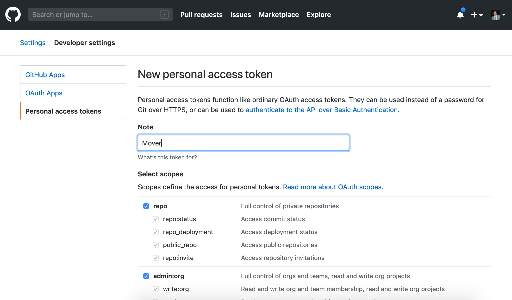
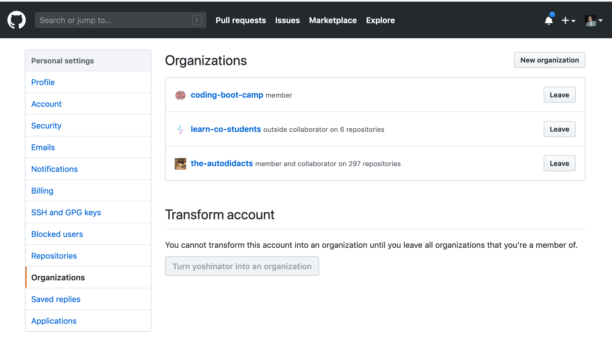
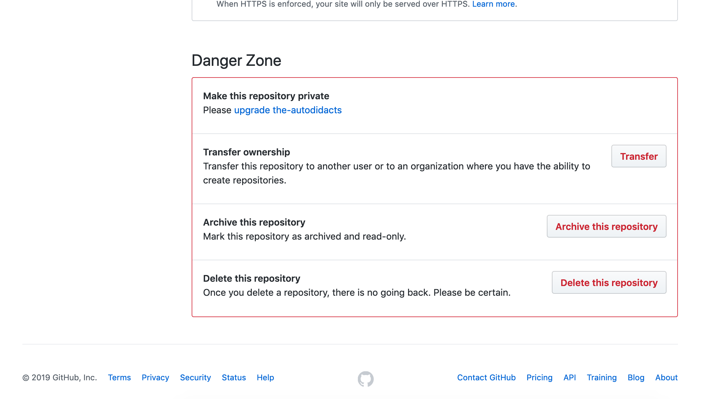

# new-github-owner

##### This npm package is an easy way to move a bunch of your personal repos to a different organization that you own to keep your main Github profile clean with out loosing any of your commits.

##### I created this tool for anyone that has a ton of repos that they have created either to test, learn or play with but don't show the projects that you want to showcase on your profile. 

# Getting started

1. Go to [github.com/settings/tokens/new](https://github.com/settings/tokens/new) and create  a new token. Give it any name you want and select repo and admin:org 



* Copy and save that token somewhere safe you will need it shortly and you can't get it back once you navigate away from that page. 

2. If you don't already have an organization where you are the admin want to move your repos to create one now. This can be done [here](https://github.com/settings/organizations)



### Now for the fun part

* in a directory run `npm install new-github-owner`
* create a js file call it anything you want.
in that file 
```javascript
const GithubOwner = require('new-github-owner')

GithubOwner()
```
run 
`node yourfile.js`

##That's it! 
 
##### Now...
Just answer three simple questions and your on your way to cleaning up your Github Profile. 
the questions are:
* Please provide your github username
* What is the organization you would like to transfer
* What is your Github Authorization key (We got this from step 1 above)

* your repos will now be located at `github.com/<your-organization-name>/<your-repo-name>`

If you have more than 100 repos run it multiple times. For now we can only move 100 repos max at a time. I just need to add a little more logic to get this done. 

Finally just move back the repos that you want to keep from the organization back to your profile by, selecting or navigating to the repo's url, clicking on settings, and changing the owner back to your name from the menu at the bottom of the page where it say "Danger Zone". 




I hope you find this helpful. 